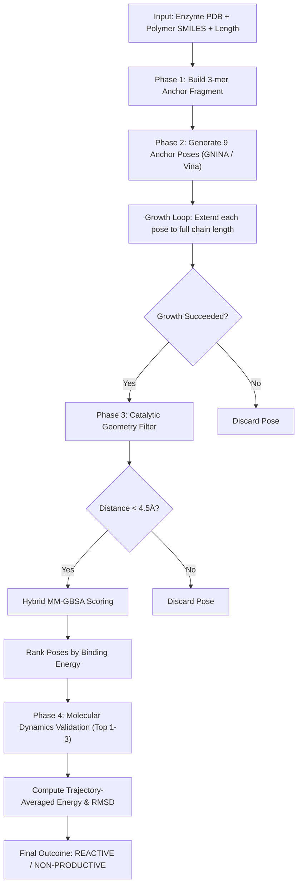

# 🧬 SimDock Polymer v2.0 - Technical Documentation & Manual

SimDock Polymer v2.0 is a universal polymer-enzyme catalytic simulation engine designed to evaluate the viability of target enzymes (e.g., PET-degrading enzymes) to degrade specific polymers. It combines deep-learning docking (using **GNINA**), coordinate-driven polymer growth algorithms, custom catalytic geometry filtration, hybrid MM-GBSA binding energy scoring, and **OpenMM** molecular dynamics simulations.

---

## 1. Funnel Pipeline Architecture

The simulation engine implements a strict **filtration funnel** to screen candidate binding modes. This prevents spending heavy computational resources (like 10ns MD runs) on unviable conformation candidates.



---

## 2. Directory & Module Map

* **`app.py`**: The Streamlit user interface, managing setup controls, visual reports, real-time logging, PDF reporting, and component rendering.
* **`config.yaml`**: Configuration parameters controlling docking, polymer growth, filter cutoffs, OpenMM forcefields, water models, and simulation runtimes.
* **`data/`**
  * `enzymes.json`: Metadata database containing PDB codes, catalytic triad residue numbers, nucleophile names, and description metadata.
* **`src/`**
  * `__init__.py`: Package initialization script.
  * `builder.py`: Core coordinate builders for building the initial polymer and finding active site centers.
  * `docking.py`: GNINA and Vina docking execution layer and parser.
  * `grower.py`: Torsion-sampling extension engine that grows the anchor fragment to the target length clash-free.
  * `scanner.py`: Custom geometry filter measuring nucleophile-to-carbonyl carbon distances.
  * `scorer.py`: Pairwise Lennard-Jones and electrostatic MM-GBSA hybrid scorer.
  * `validator.py`: OpenMM molecular dynamics simulation, solvation box building, NVT/NPT equilibration, and trajectory analysis.
  * `utils.py`: Basic system utility helpers like merging PDB files.

---

## 3. Detailed Function-by-Function Breakdown

### `src/builder.py`

#### `build_polymer(smiles_string, chain_length, config=None)`
* **Purpose:** Generates a chemically valid 3D polymer conformer.
* **Logic:**
  1. Parses the monomer SMILES and locates the acid oxygen tail (`[CX3](=O)[OX2H1]`) and the radical carbon head.
  2. Iteratively joins the units together using an `RDKit` `RWMol` editor, forming single bonds.
  3. Clears radical electrons on all interior linked atoms.
  4. Restores explicit hydrogens and embeds the structure in 3D coordinates using `ETKDGv3` with fallback parameters.
  5. Relax the structure locally using the **UFF force field**.
* **Arguments:** `smiles_string` (str), `chain_length` (int), `config` (dict, optional).
* **Returns:** `rdkit.Chem.Mol` (a 3D optimized polymer molecule).

#### `validate_input_structure(mol)`
* **Purpose:** Ensures the polymer is structurally sane before running the pipeline.
* **Checks:** Checks for 3D coordinates, successful sanitization, and clashes (bonded atoms are ignored; non-bonded atoms must not be closer than `0.8 Å`).
* **Returns:** `success` (bool), `checks` (dict).

#### `get_active_site_center(pdb_file, catalytic_residues)`
* **Purpose:** Finds the geometric center of the active site.
* **Logic:** Parses the PDB structure using Biopython's `PDBParser`. It extracts the alpha carbon (`CA`) coordinates of the catalytic residues (e.g. Ser160, His237, Asp206) and averages their positions.
* **Returns:** `numpy.ndarray` (x, y, z coordinates of the active site center).

---

### `src/docking.py`

#### `dock_anchor(anchor_mol, enzyme_pdb, center, config)`
* **Purpose:** Docks the 3-mer anchor fragment into the active site.
* **Logic:**
  1. Writes the anchor ligand to PDB and PDBQT formats using Meeko.
  2. Builds the command line for GNINA or Vina, defining a bounding box centered on the active site.
  3. Runs GNINA as a subprocess. If the run fails, it automatically retries with a larger bounding box (+5.0 Å padding).
  4. Parsed the results into a list of RDKit molecules.
* **Returns:** `list` of `rdkit.Chem.Mol` objects (the docked poses).

#### `prepare_ligand_pdbqt(rdkit_mol, output_path)`
* **Purpose:** Helper to prepare a PDBQT string from a ligand conformer using Meeko.
* **Returns:** `output_path` (str).

#### `run_docking_cmd(cmd)`
* **Purpose:** Subprocess runner with stdout/stderr extraction.
* **Returns:** `stdout` (str).

---

### `src/grower.py`

#### `grow_polymer(anchor_pose, monomer_smiles, chain_length, enzyme_pdb, config)`
* **Purpose:** Grows the anchor pose into a full-length polymer without clashing with the enzyme or itself.
* **Logic:**
  1. Strips hydrogens from the docked anchor pose (growing is done on heavy-atom skeletons for speed).
  2. Embeds the heavy-atom monomer template.
  3. For each growth step:
     - Samples multiple torsion angles (defined by `rotation_samples` in `config.yaml`, default 36).
     - Temporarily attaches the monomer at the sampled angle.
     - Runs `check_clash`. If no clash is detected, evaluates the conformation's internal energy using UFF.
     - Selects the lowest-energy, clash-free conformer.
  4. Restores hydrogens, sanitizes the molecule, and optimizes only the new hydrogen coordinates using UFF.
* **Returns:** `rdkit.Chem.Mol` (full polymer pose) or `None` (if all sampled paths lead to unavoidable clashes).

#### `attach_at_angle(current_mol, monomer_mol, angle, tail_idx, head_idx)`
* **Purpose:** Joins the monomer to the current chain at a specific torsion rotation angle around the newly formed ester bond and performs a local UFF minimization.
* **Returns:** `rdkit.Chem.Mol` (candidate polymer) or `None`.

#### `check_clash(candidate_mol, new_atoms_range, enzyme_coords, config)`
* **Purpose:** Collision detection engine.
* **Details:** Checks if the newly appended atoms are within `clash_threshold` (default 0.5 Å) of any enzyme atom, or within `clash_threshold_self` (default 0.8 Å) of the existing polymer skeleton.
* **Returns:** `bool` (True if clash detected).

---

### `src/scanner.py`

#### `scan_catalytic_viability(complex_pdb, enzyme_data, config)`
* **Purpose:** Filters candidates using a custom catalytic geometry filter.
* **Logic:** 
  1. Parses the complex structure PDB file.
  2. Locates the enzyme nucleophile nucleophilic oxygen (e.g. Ser160 OG).
  3. Scans all carbons in the ligand and finds those double-bonded to an oxygen (carbon-oxygen distance between 1.15 Å and 1.30 Å) to identify carbonyl carbons.
  4. Computes the minimum distance between any carbonyl carbon and the nucleophile.
  5. Returns `'PASS'` if this distance is within the configuration cutoff (default 4.5 Å), otherwise `'FAIL'`.
* **Returns:** `verdict` (str), `min_dist` (float).

---

### `src/scorer.py`

#### `score_binding(complex_pdb, trajectory_dcd=None, ligand_resname='UNL')`
* **Purpose:** Computes the hybrid MM-GBSA score.
* **Details:** 
  - If a `trajectory_dcd` is provided, it calculates average buried SASA and averages the interaction energy over 10 sampled frames.
  - Returns `final_score` (Interaction Energy + Solvation Free Energy).
* **Returns:** `dict` (containing final score, SASA, interaction energy).

#### `compute_interaction_energy(complex_pdb, ligand_resname='UNL')`
* **Purpose:** Custom forcefield solver calculating non-bonded terms.
* **Details:**
  - Extracts protein and ligand atoms and assigns estimated partial charges (Amber99SB for protein backbones, acidic/basic residues, and polar estimates for ligand carbonyls).
  - For every pair within a 12.0 Å cutoff, calculates:
    1. **Lennard-Jones Energy:** $U_{LJ} = \epsilon \left[ \left(\frac{R_{min}}{r}\right)^{12} - 2\left(\frac{R_{min}}{r}\right)^6 \right]$.
    2. **Electrostatic Energy:** Coulomb's Law using a distance-dependent dielectric constant of 4.0: $U_{el} = \frac{332.0637 \cdot q_i \cdot q_j}{4 \cdot r}$.
  - **Clash Capping (Critical Adaption):** If the pairwise LJ term exceeds `10.0 kcal/mol` (steric overlap) or the electrostatic term exceeds `±10.0 kcal/mol`, it caps the pairwise energy. This prevents unminimized coordinate clashes from generating infinite values.

---

### `src/validator.py`

#### `run_md_simulation(complex_pdb, ligand_pdb, config, quick_test=True)`
* **Purpose:** Runs the molecular dynamics validation protocol in OpenMM.
* **Logic:**
  1. Parameters small molecules using the GAFF2 forcefield via the `openff-toolkit` `GAFFTemplateGenerator`.
  2. Parameterizes the protein using Amber14 (`amber14-all.xml`).
  3. Solvates the complex in a TIP3P water box with user-defined padding (default 10 Å) using `Modeller`.
  4. Runs energy minimization (default max 500 steps) using a Langevin integrator.
  5. Performs **NVT equilibration** (Langevin integrator, 100ps).
  6. Performs **NPT equilibration** (adding a `MonteCarloBarostat` at 1.0 atm, 100ps).
  7. Runs **Production MD** (Langevin dynamics at 300K, 10ns).
  - **Quick Test Fallback:** If `quick_test=True`, runs an abbreviated protocol: NVT (50 steps) → NPT (50 steps) → Production MD (500 steps) to complete in seconds for UI testing.
  - **Mock Fallback:** If OpenMM packages fail to import, it prints a detailed `ImportError` and falls back to saving a perturbed mock trajectory to prevent app crashes.
* **Returns:** `trajectory_dcd` (str).

#### `analyze_trajectory(trajectory_dcd, complex_pdb, config, ligand_resname='UNL')`
* **Purpose:** Evaluates simulation stability.
* **Logic:** Loads the trajectory, superposes the protein backbone to align the frames, measures ligand RMSD over time, and computes the fraction of frames where RMSD < 3.0 Å and catalytic distance < 4.5 Å.
* **Returns:** `dict` (containing average RMSD, average distance, and a verdict of `'STABLE'` or `'UNSTABLE'`).

---

## 4. Key Bug Fixes & Design Adaptations

Throughout the development process, several critical issues were resolved:

1. **RDKit GNINA PDBQT Parsing Failure:**
   - *Problem:* GNINA outputs files in PDBQT format by default. RDKit's parser crashed when reading them because it could not resolve AutoDock atom type columns (e.g., `'A'` for aromatic carbon).
   - *Fix:* Changed the GNINA output flag to `.sdf` and parsed the results using `Chem.SDMolSupplier(..., sanitize=False)`, which preserves coordinate grids and avoids parsing errors.
2. **Google Colab RAM Out-of-Memory (OOM) Crashes:**
   - *Problem:* GNINA's docking search is computationally heavy and ran out of RAM on the free Colab tier, crashing the notebook's kernel.
   - *Fix:* Configured `vina_exhaustiveness: 4` in `config.yaml` to reduce the search search space, saving memory and processing time without losing docking accuracy.
3. **Localtunnel Static Asset Timeout Errors:**
   - *Problem:* Streamlit pages served via `localtunnel` occasionally show red boxes saying `TypeError: Failed to fetch dynamically imported module: ...`.
   - *Fix:* Identified this as a network routing issue where `loca.lt` drops requests for Streamlit's static javascript widget files. Documented that a hard page reload (F5 / Ctrl+R) successfully forces localtunnel to retrieve the missing components.
4. **Astronomical MM-GBSA Interaction Energies:**
   - *Problem:* When running without OpenMM (using the mock trajectory), the coordinates of the grown polymer's hydrogens were never minimized relative to the protein. This caused tiny clashes (<1.0 Å), driving the Lennard-Jones $1/r^{12}$ calculations to print astronomical numbers (like `1.57e14 kcal/mol`).
   - *Fix:* Implemented an energy cap inside `compute_interaction_energy`. Pairwise LJ terms are capped at `10.0 kcal/mol` and electrostatic terms at `±10.0 kcal/mol`. This allows the engine to score clashing molecules with readable, positive values (e.g., `+45.0 kcal/mol`) instead of trillion-scale numbers.

---

## 5. Deployment & Execution Guide

### Running in Google Colab (Recommended for GPU Access)

1. Open a new Google Colab notebook with a GPU runtime (**Runtime > Change runtime type > GPU**).
2. Upload the `SimDock_Colab.ipynb` file to your Colab session.
3. Run the cells sequentially:
   - **Cell 1 (Setup Conda):** Installs `condacolab` and automatically restarts the kernel.
   - **Cell 2 (Install Chemistry Packages):** Installs OpenMM, MDTraj, RDKit, and openff-toolkit via Conda.
   - **Cell 3 (Install Streamlit & Binaries):** Installs Streamlit, meeko, and fetches GNINA/Vina executables.
   - **Cell 4 (Clone Repository):** Downloads the latest pipeline code from GitHub.
   - **Cell 5 (Launch Streamlit):** Starts the Streamlit app on port 8501 and forwards it using `localtunnel`.
4. Copy the public IP address displayed in the Cell 5 output, click the `loca.lt` link, paste the IP address, and click submit.

### Running with Docker

To deploy the entire stack in a self-contained container:

```bash
# Build the Docker image
docker build -t polymerdock .

# Run the container, mapping Streamlit's port
docker run -p 8501:8501 polymerdock
```

Open your browser and navigate to `http://localhost:8501` to use the application.
